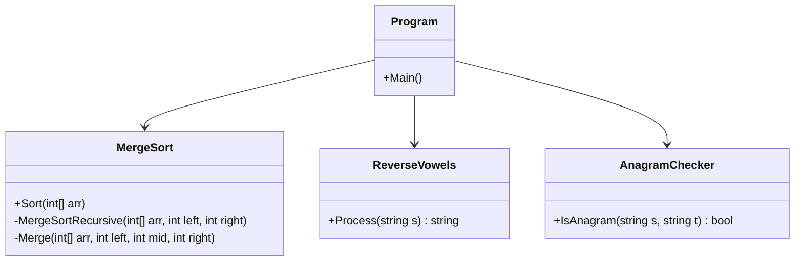
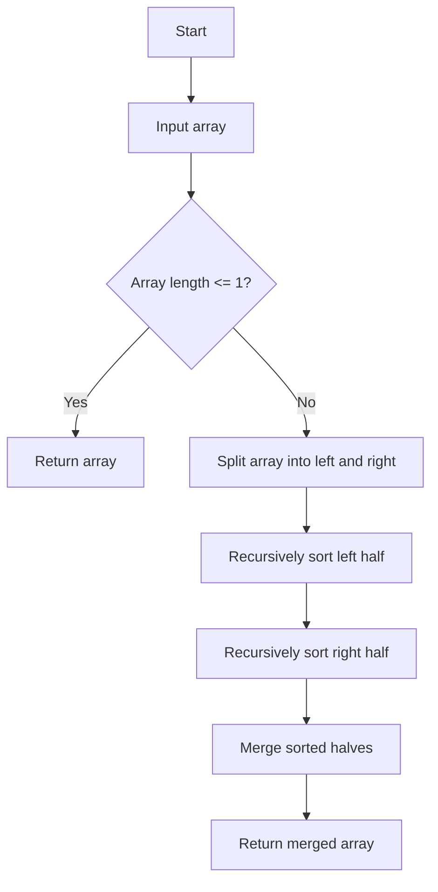
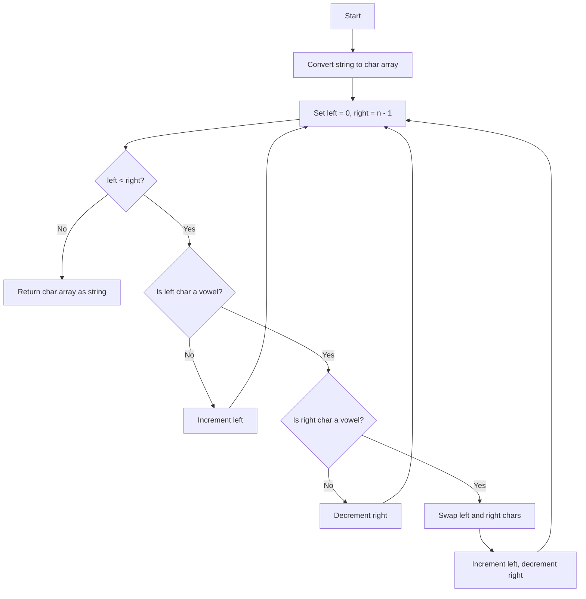
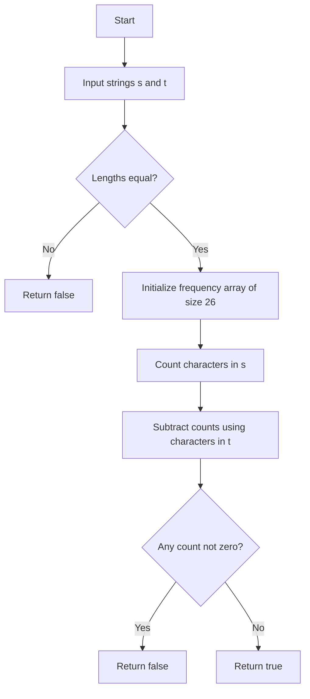

<p align="center">
  
</p>

<p align="center">
  
  
  <a href="https://github.com/brovy23-GD/Rovy_Assignement_7_2">
    
  </a>
  <a href="https://github.com/brovy23-GD/Rovy_Assignement_7_2">
    
  </a>
  
</p>

# Rovy Assignment 7.2

C# console application featuring three core algorithm and data structure exercises completed as part of MSSA coursework: Merge Sort, Reverse Vowels, and Anagram Checker. This project demonstrates recursive problem solving, string manipulation, array-based frequency counting, and clean class-based organization in C#.

## Project Highlights

- Built in C# with separate classes for each algorithm to improve readability, maintainability, and modular design.
- Demonstrates core technical skills including recursion, divide-and-conquer sorting, two-pointer traversal, array manipulation, and algorithm analysis.
- Uses a console-driven workflow through Program.cs to run and test each algorithm from one entry point.

## Algorithms Included

### 1) Merge Sort

Implements the classic divide-and-conquer sorting algorithm by recursively splitting the array, sorting each half, and merging the results into a sorted output.

Concepts demonstrated:

- Recursion
- Divide and conquer
- Array traversal
- Temporary merge buffers
- Time complexity analysis

Complexity:

- Time: O(n log n)
- Space: O(n)

### 2) Reverse Vowels

Reverses only the vowels in a string using a two-pointer approach, moving inward from both ends and swapping vowels while leaving other characters unchanged.

Concepts demonstrated:

- Two-pointer technique
- String-to-array conversion
- In-place character swapping
- Conditional traversal

Complexity:

- Time: O(n)
- Space: O(1) extra space (excluding character array conversion)

### 3) Anagram Checker

Determines whether two strings are anagrams by counting character frequency with a fixed-size array and verifying both strings contain the same letters in the same quantities.

Concepts demonstrated:

- Frequency arrays
- Character normalization
- Input validation
- Efficient comparison without sorting

Complexity:

- Time: O(n)
- Space: O(1)

## Tech Stack

- C#
- .NET / Visual Studio
- Console application
- Algorithms and Data Structures fundamentals

## Project Structure

```text
Rovy_Assignement_7_2/
|-- Program.cs
|-- MergeSort.cs
|-- ReverseVowels.cs
|-- AnagramChecker.cs
`-- README.md
```

## UML Class Diagram



## Algorithm Flowcharts

### 1) Merge Sort Flowchart



### 2) Reverse Vowels Flowchart



### 3) Anagram Checker Flowchart



## Trace Tables

### 1) Merge Sort Trace Table Example

Input

```text
[4][5][6][7]
```

| Step | Left Half   | Right Half | Action              |
|------|-------------|------------|---------------------|
| 1    | [5, 2]      | [9, 1]     | Split               |
| 2    | [5] [2]     | [9] [1]    | Split to base case  |
| 3    | [5, 2]      | [9, 1]     | Merge each pair     |
| 4    | [2, 5]      | [1, 9]     | Sorted halves       |
| 5    | [2, 5, 1, 9] |            | Final merge         |
| 6    | [1, 2, 5, 9] |            | Final sorted output |

### 2) Reverse Vowels Trace Table Example

Input

```text
hello
```

| Step | Left | Right | Left Char | Right Char | Action            | Result |
|------|------|-------|-----------|------------|-------------------|--------|
| 1    | 0    | 4     | h         | o          | Right vowel found |        |
| 2    | 1    | 4     | e         | o          | Swap e and o      | holle  |
| 3    | 2    | 3     | l         | l          | Move pointers     | holle  |
| 4    | 2    | 2     | -         | -          | Stop              | holle  |

### 3) Anagram Checker Trace Table Example

Input

```text
s = "anagram"
t = "nagaram"
```

| Step | Char | Count Change | Notes                     |
|------|------|--------------|---------------------------|
| 1    | a    | +1           | Count from s              |
| 2    | n    | +1           |                           |
| 3    | a    | +1           |                           |
| 4    | g    | +1           |                           |
| 5    | r    | +1           |                           |
| 6    | a    | +1           |                           |
| 7    | m    | +1           |                           |
| 8    | n    | -1           | Subtract from t           |
| 9    | a    | -1           |                           |
| 10   | g    | -1           |                           |
| 11   | a    | -1           |                           |
| 12   | r    | -1           |                           |
| 13   | m    | -1           |                           |
| 14   | a    | -1           | All counts return to zero |

## Time and Space Complexity Summary

| Algorithm       | Time Complexity | Space Complexity | Notes                                   |
|----------------|-----------------|------------------|-----------------------------------------|
| Merge Sort     | O(n log n)      | O(n)             | Uses extra arrays during merge          |
| Reverse Vowels | O(n)            | O(1)             | Two-pointer technique, in-place swap    |
| Anagram Checker| O(n)            | O(1)             | Fixed-size frequency array (26 letters) |

## How to Run

1. Open the solution in Visual Studio.
2. Build the project.
3. Run the application.
4. Follow the console prompts to:
   - Enter numbers for Merge Sort.
   - Enter a string for Reverse Vowels.
   - Enter two strings for Anagram Checker.

## Sample Output

### Merge Sort

Input

```text
5 2 9 1
```

Output

```text
1, 2, 5, 9
```

### Reverse Vowels

Input

```text
hello
```

Output

```text
holle
```

### Anagram Checker

Input

```text
anagram
nagaram
```

Output

```text
true
```

## What This Project Shows

This project showcases my ability to write organized, beginner-to-intermediate C# code with a focus on algorithmic thinking, readability, and problem decomposition. It also reflects my MSSA training in foundational software development concepts such as recursion, string processing, array operations, and clean separation of concerns across classes.

## Next Improvements

Planned enhancements for future iterations:

- Add input validation for invalid or empty console entries.
- Support punctuation and whitespace handling in the anagram checker.
- Add unit tests for each algorithm.
- Improve console formatting for a cleaner user experience.
- Refactor repeated logic into helper methods where appropriate.

## Version

v1.0.0

Initial release featuring three complete algorithm implementations with documentation and console-based execution flow.

## License

MIT License
