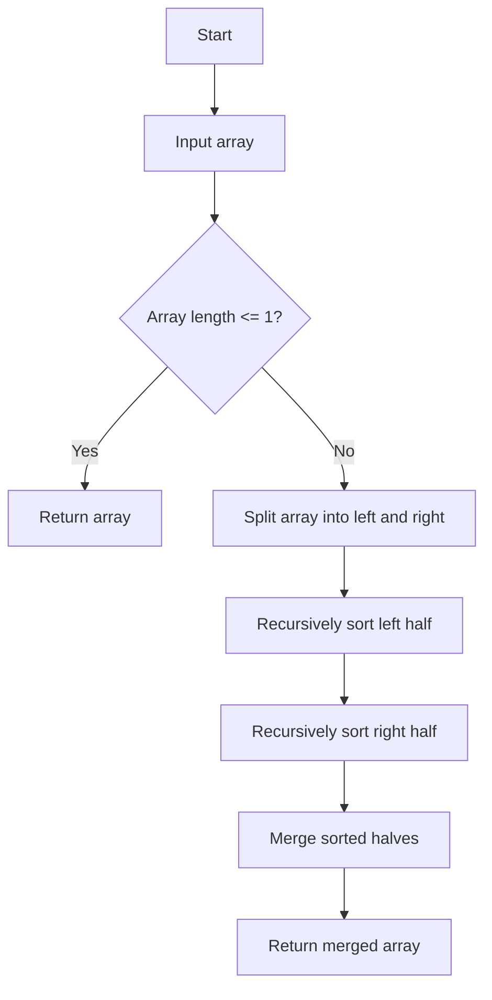
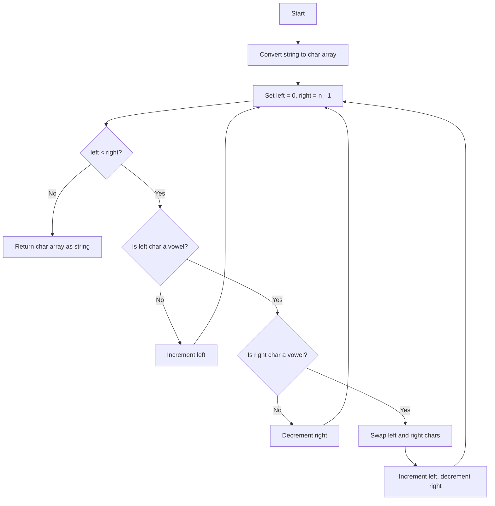
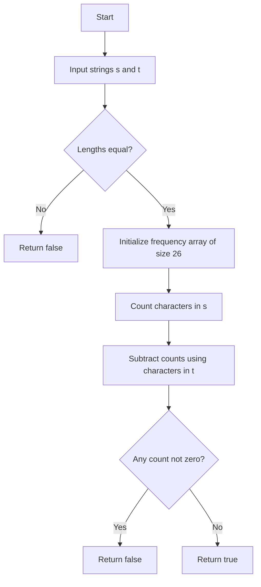

## Algorithm Flowcharts

### 1) Merge Sort Flowchart

```mermaid
flowchart TD
    A[Start] --> B[Input array]
    B --> C{Array length <= 1?}
    C -->|Yes| D[Return array]
    C -->|No| E[Split array into left and right]
    E --> F[Recursively sort left half]
    F --> G[Recursively sort right half]
    G --> H[Merge sorted halves]
    H --> I[Return merged array]
```

### 2) Reverse Vowels Flowchart

```mermaid
flowchart TD
    A[Start] --> B[Convert string to char array]
    B --> C[Set left = 0, right = n - 1]
    C --> D{left < right?}
    D -->|No| E[Return char array as string]
    D -->|Yes| F{Is left char a vowel?}
    F -->|No| G[Increment left]
    G --> C
    F -->|Yes| H{Is right char a vowel?}
    H -->|No| I[Decrement right]
    I --> C
    H -->|Yes| J[Swap left and right chars]
    J --> K[Increment left, decrement right]
    K --> C
```

### 3) Anagram Checker Flowchart

```mermaid
flowchart TD
    A[Start] --> B[Input strings s and t]
    B --> C{Lengths equal?}
    C -->|No| D[Return false]
    C -->|Yes| E[Initialize frequency array of size 26]
    E --> F[Count characters in s]
    F --> G[Subtract counts using characters in t]
    G --> H{Any count not zero?}
    H -->|Yes| I[Return false]
    H -->|No| J[Return true]
```
